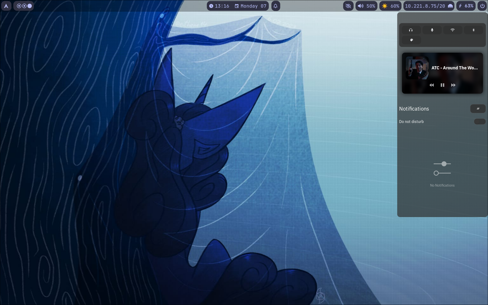
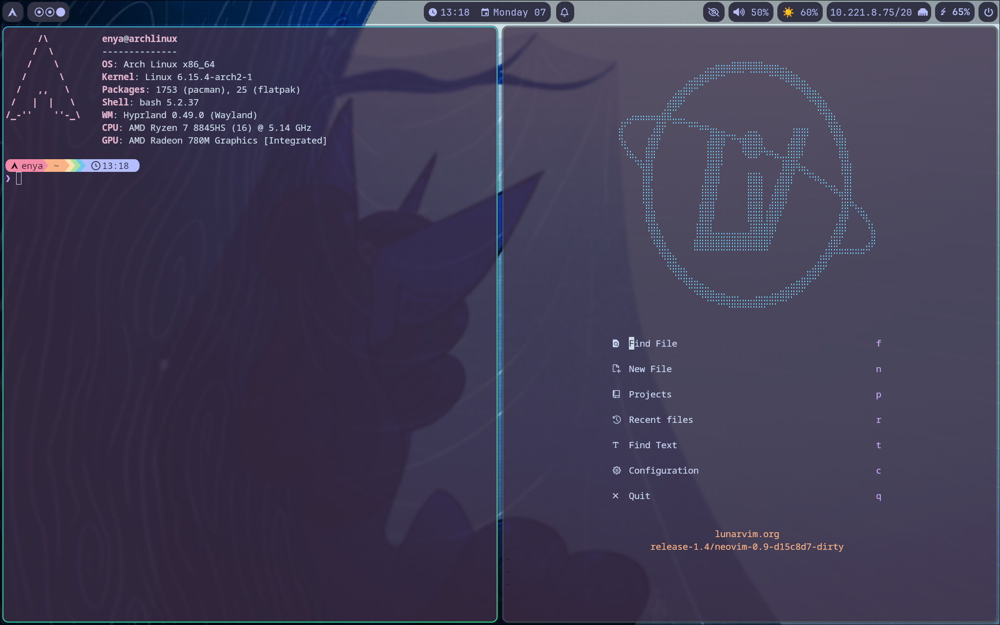

# Arch Linux Setup with Catppuccin Mocha theme

## Table of Contents
<!-- vim-markdown-toc GFM -->

* [Preview](#preview)
* [Resources used to create the configurations](#resources-used-to-create-the-configurations)
    * [Managing dotfiles](#managing-dotfiles)
    * [Other dotfiles used](#other-dotfiles-used)
* [Included configurations](#included-configurations)
* [Descriptions of configurations](#descriptions-of-configurations)
    * [Bash](#bash)
    * [Hyprland](#hyprland)
        * [Hyprlock](#hyprlock)
    * [Kitty](#kitty)
    * [LunarVim](#lunarvim)
    * [Tmux](#tmux)
* [To Do](#to-do)

<!-- vim-markdown-toc -->
## Preview



## Resources used to create the configurations
### Managing dotfiles
Tutorial: [Managing your dotfiles - System Crafters](https://www.youtube.com/playlist?list=PLEoMzSkcN8oNB7Xm3RNKMy_vygbDlj666)

Dotfile manager: [GNU Stow](https://www.gnu.org/software/stow/)

### Other dotfiles used
Base for Hyprland customization: [🌙 Catppuccin Mocha Inspired Hyprland Setup - rickinshah](https://github.com/rickinshah/hyprland-dotfiles/tree/main)

## Included configurations
- [bash](https://www.gnu.org/software/bash/) - Terminal shell
- [Hyprland](https://hypr.land/) - Window Manager
  - [Hyprlock](https://github.com/hyprwm/hyprlock/) - Screen locking utility 
  - [Hyprpaper](https://github.com/hyprwm/hyprpaper) - Wallpaper utility
  - [Waybar](https://github.com/Alexays/Waybar) - Customizable Wayland bar
  - [xdg-desktop-portal](https://wiki.archlinux.org/title/XDG_Desktop_Portal) - Framework for accessiing resources from outside an application sandbox
- [Kitty](https://sw.kovidgoyal.net/kitty/) - GPU based terminal emulator
  - [Starship](https://starship.rs/) - Customizable cross-shell prompt
- [LunarVim](https://www.lunarvim.org/) - IDE layer for [Neovim](https://neovim.io/)
- [Tmux](https://github.com/tmux/tmux) - Terminal multiplexer

## Descriptions of configurations

### Bash
Includes settings for:
- [fastfetch](https://github.com/fastfetch-cli/fastfetch) - used to show system settings when opening the terminal
- [fzf](https://github.com/junegunn/fzf) - CLI fuzzy finder
- [docker](https://wiki.archlinux.org/title/Docker) - container utility that I use for [Winapps](https://github.com/winapps-org/winapps)
### Hyprland
Includes the following settings:
- Monitor: 2560x1440@120Hz, scale at 1
- File manager: [Dolphin](https://apps.kde.org/dolphin/)[^1]
- Browser: [Zen Browser](https://zen-browser.app/)
- Screenshot utility: [Hyprshot](https://github.com/Gustash/hyprshot)
- Input:
  - CapsLock is changed to be a second Escape
  - Ctrl+Alt for keyboard layout swap (us, ro)[^2]
- Binds:
  - SUPER+B - Browser
  - PRINT - Full window screenshot
  - Shift+PRINT - Selection screenshot
  - SUPER+Shift+l - Lock desktop
  - SUPER+W - Toggle waybar

[^1]: Dolphin does seem to sometime have an issue of not being able to open files due to not having any default apps to open them with.
While I was able to fix this using the solutions from this [thread](https://bbs.archlinux.org/viewtopic.php?pid=2167442), I do have [Thunar](https://docs.xfce.org/xfce/thunar/start) installed in case the issue reappears.
[^2]: On To Do list to fix as of the time of writing this; bind doesn't work 
#### Hyprlock
Includes a simple password input.

For fingerprint scanner usage, is necesary to:
- install `fprintd` and `libfprint`;
- enroll your fingerprint:
```
fprintd-enroll
```
- the following config in `/etc/pam.d/hyprlock`:
```
# PAM configuration file for hyprlock
# the 'login' configuration file (see /etc/pam.d/login)

# Hyprlock PAM config that allows either password or fingerprint
auth sufficient pam_fprintd.so
auth requisite pam_deny.so
auth required pam_permit.so
auth        include     login
```

For login with fingerprint you have to first press Enter before scanning.

### Kitty

### LunarVim

### Tmux

## To Do
- [ ] Fix keyboard layout switching in Hyprland
- [ ] Add descriptions:
  - [ ] Kitty
  - [ ] LunarVim
  - [ ] Tmux
